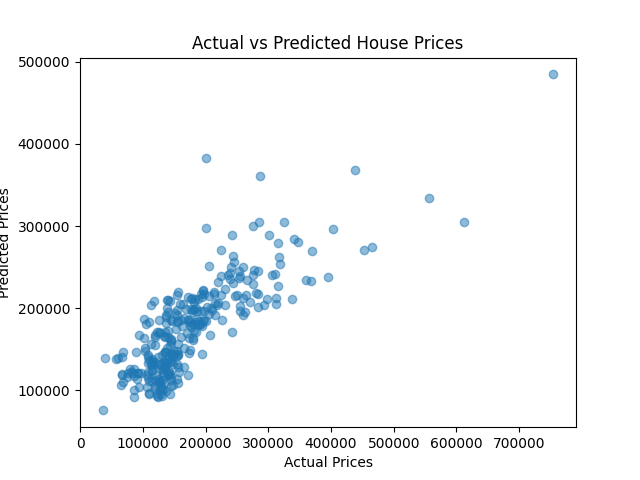

# House Price Prediction

This project uses a **Multiple Linear Regression** model to predict house prices based on:

- Square Footage (`GrLivArea`)
- Number of Bedrooms (`BedroomAbvGr`)
- Number of Full Bathrooms (`FullBath`)

## 📊 Output

- Mean Squared Error
- R² Score
- Scatter plot comparing actual vs predicted house prices

## 🧰 Tools Used
- Python
- Pandas
- scikit-learn
- Matplotlib

## 🚀 How to Run

1. Install dependencies:
    ```
    pip install pandas numpy matplotlib scikit-learn
    ```

2. Place `train.csv` from Kaggle in the root directory.

3. Run the script:
    ```
    python house_price_predictor.py
    ```

## 📷 Sample Plot

  
